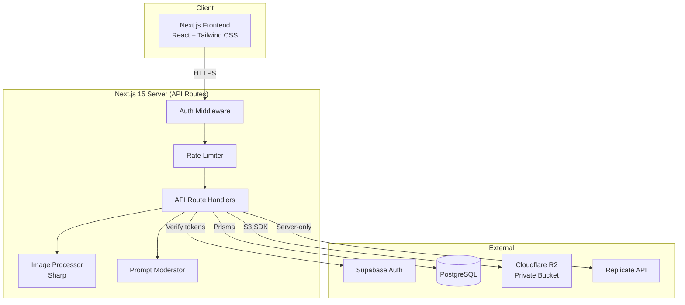
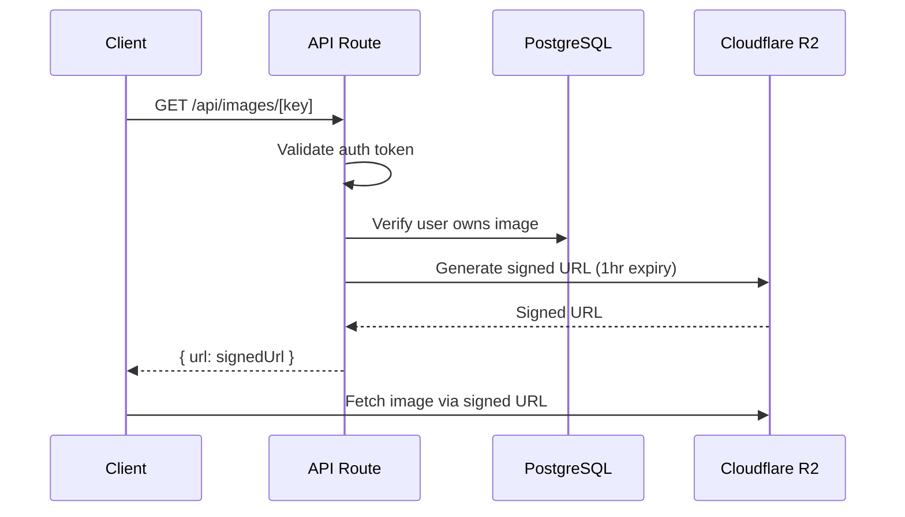
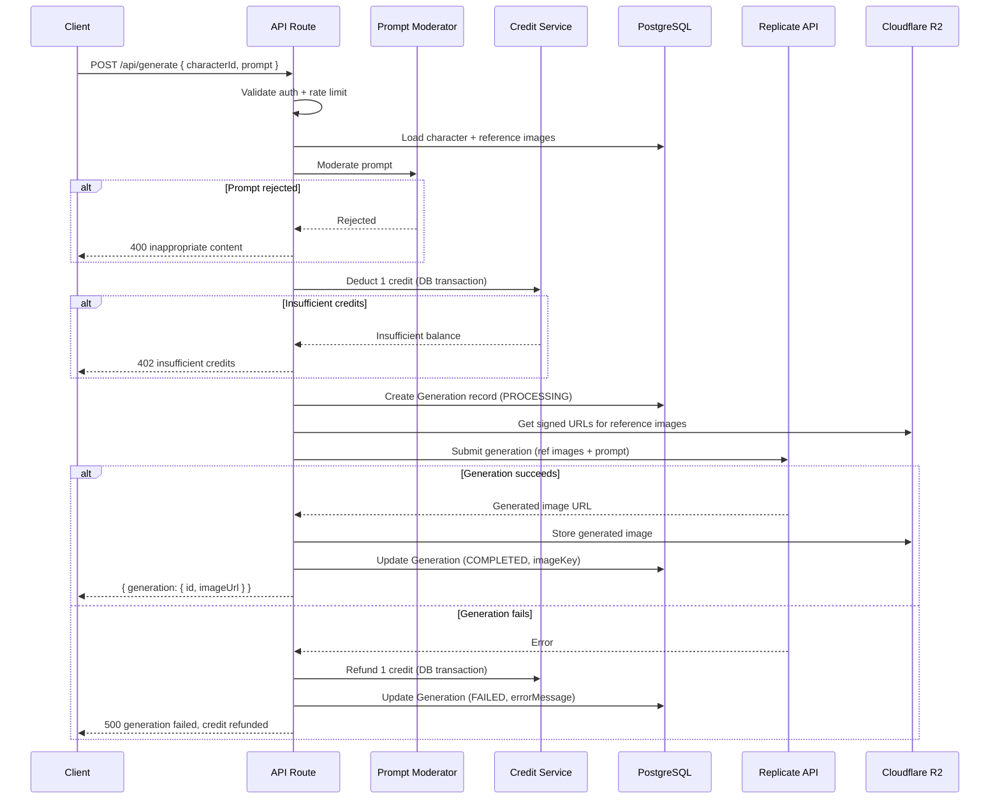
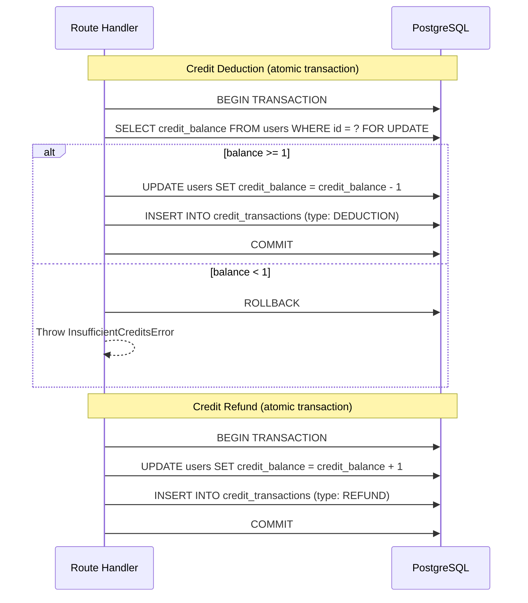
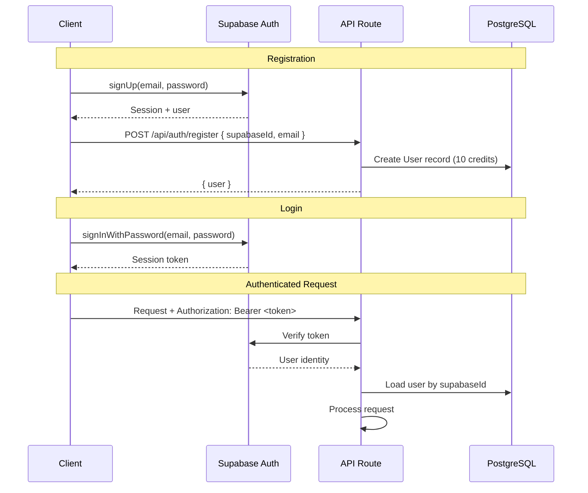

# Design Document: CharacterForge AI

## Overview

CharacterForge AI is a web application that enables users to create persistent character profiles with reference images, then generate new AI scene images depicting those characters in various contexts while maintaining appearance consistency. The system is built as a Next.js 15 application with server-side API routes that orchestrate Supabase Auth, PostgreSQL via Prisma, Cloudflare R2 for private image storage, and Replicate API for AI image generation. A credit-based model governs usage, and strict security practices protect uploads, API keys, and user data.

The MVP focuses on:
- Secure authentication via Supabase Auth
- Character profile CRUD with 1-3 reference images
- AI scene generation via Replicate with credit gating
- Private image storage with signed URLs
- Rate limiting and input validation

## Architecture



### Request Flow

1. Client sends request with Supabase session token
2. Auth middleware validates token with Supabase
3. Rate limiter checks per-user limits (sliding window)
4. Route handler processes business logic
5. For generation: deduct credit → moderate prompt → call Replicate → store result → respond
6. For uploads: validate → process (strip EXIF, resize) → upload to R2 → save record

### Key Design Decisions

| Decision | Rationale |
|----------|-----------|
| Next.js API routes for backend | Single deployment, shared types, simpler infra |
| Supabase Auth (not custom) | Battle-tested, handles sessions/tokens, reduces auth code |
| Cloudflare R2 (not S3) | S3-compatible API, no egress fees, lower cost |
| Signed URLs (not public bucket) | Images remain private, access is time-limited |
| Replicate API (not self-hosted) | No GPU infrastructure needed, pay-per-use |
| Credit deduct before generation | Prevents race conditions, refund on failure |
| Sharp for image processing | Fast, handles EXIF stripping and validation |
| Sliding window rate limiting | More fair than fixed windows, prevents burst abuse |

## Components and Interfaces

### Frontend Pages

| Route | Page | Description |
|-------|------|-------------|
| `/` | Landing | Marketing page with sign-up CTA |
| `/login` | Login | Email/password login form |
| `/register` | Register | Email/password registration form |
| `/dashboard` | Dashboard | Character list, credit balance display |
| `/characters/new` | Create Character | Name, description, image upload form |
| `/characters/[id]` | Character Detail | View character, trigger generation, view history |
| `/history` | Generation History | Paginated list of all generations |

### Backend API Routes

| Method | Route | Auth | Rate Limit | Description |
|--------|-------|------|------------|-------------|
| POST | `/api/auth/register` | No | 60/min | Create account, assign 10 credits |
| POST | `/api/auth/login` | No | 60/min | Authenticate user |
| POST | `/api/auth/logout` | Yes | 60/min | Invalidate session |
| GET | `/api/characters` | Yes | 60/min | List user's characters |
| POST | `/api/characters` | Yes | 60/min | Create character profile |
| GET | `/api/characters/[id]` | Yes | 60/min | Get character with images |
| DELETE | `/api/characters/[id]` | Yes | 60/min | Delete character + images + history |
| POST | `/api/characters/[id]/images` | Yes | 60/min | Upload reference image |
| DELETE | `/api/characters/[id]/images/[imageId]` | Yes | 60/min | Delete reference image |
| POST | `/api/generate` | Yes | 10/hr | Generate scene image |
| GET | `/api/generations` | Yes | 60/min | Paginated generation history |
| GET | `/api/credits` | Yes | 60/min | Get balance + transactions |
| GET | `/api/images/[key]` | Yes | 60/min | Get signed URL for image |

### Core Service Interfaces

```typescript
// Character Service
interface CharacterService {
  create(userId: string, data: { name: string; description: string }): Promise<Character>;
  list(userId: string): Promise<Character[]>;
  getById(userId: string, characterId: string): Promise<Character & { images: ReferenceImage[] }>;
  delete(userId: string, characterId: string): Promise<void>;
}

// Upload Service
interface UploadService {
  validateAndUpload(
    userId: string,
    characterId: string,
    file: File
  ): Promise<ReferenceImage>;
  deleteImage(userId: string, imageId: string): Promise<void>;
  getSignedUrl(key: string, expiresIn?: number): Promise<string>;
}

// Generation Service
interface GenerationService {
  generate(
    userId: string,
    characterId: string,
    prompt: string,
    highConsistency?: boolean
  ): Promise<Generation>;
}

// Credit Service
interface CreditService {
  getBalance(userId: string): Promise<number>;
  deduct(userId: string, generationId: string): Promise<void>;
  refund(userId: string, generationId: string): Promise<void>;
  getTransactions(userId: string, limit?: number): Promise<CreditTransaction[]>;
}

// Rate Limiter
interface RateLimiter {
  checkLimit(userId: string, endpoint: string): Promise<{ allowed: boolean; retryAfter?: number }>;
}
```

## Data Models

### Prisma Schema

```prisma
generator client {
  provider = "prisma-client-js"
}

datasource db {
  provider = "postgresql"
  url      = env("DATABASE_URL")
}

model User {
  id            String   @id @default(uuid())
  supabaseId    String   @unique @map("supabase_id")
  email         String   @unique
  creditBalance Int      @default(10) @map("credit_balance")
  createdAt     DateTime @default(now()) @map("created_at")
  updatedAt     DateTime @updatedAt @map("updated_at")

  characters    Character[]
  generations   Generation[]
  transactions  CreditTransaction[]

  @@map("users")
}

model Character {
  id          String   @id @default(uuid())
  userId      String   @map("user_id")
  name        String   @db.VarChar(100)
  description String   @db.VarChar(1000)
  createdAt   DateTime @default(now()) @map("created_at")
  updatedAt   DateTime @updatedAt @map("updated_at")

  user        User     @relation(fields: [userId], references: [id], onDelete: Cascade)
  images      ReferenceImage[]
  generations Generation[]

  @@index([userId])
  @@map("characters")
}

model ReferenceImage {
  id           String   @id @default(uuid())
  characterId  String   @map("character_id")
  storageKey   String   @map("storage_key")
  filename     String
  mimeType     String   @map("mime_type")
  sizeBytes    Int      @map("size_bytes")
  width        Int
  height       Int
  uploadedAt   DateTime @default(now()) @map("uploaded_at")

  character    Character @relation(fields: [characterId], references: [id], onDelete: Cascade)

  @@index([characterId])
  @@map("reference_images")
}

model Generation {
  id           String           @id @default(uuid())
  userId       String           @map("user_id")
  characterId  String           @map("character_id")
  prompt       String           @db.Text
  status       GenerationStatus @default(PENDING)
  imageKey     String?          @map("image_key")
  errorMessage String?          @map("error_message")
  createdAt    DateTime         @default(now()) @map("created_at")
  completedAt  DateTime?        @map("completed_at")

  user         User      @relation(fields: [userId], references: [id], onDelete: Cascade)
  character    Character @relation(fields: [characterId], references: [id], onDelete: Cascade)
  transactions CreditTransaction[]

  @@index([userId, createdAt(sort: Desc)])
  @@index([characterId])
  @@map("generations")
}

enum GenerationStatus {
  PENDING
  PROCESSING
  COMPLETED
  FAILED
}

model CreditTransaction {
  id           String          @id @default(uuid())
  userId       String          @map("user_id")
  generationId String?         @map("generation_id")
  amount       Int
  type         TransactionType
  createdAt    DateTime        @default(now()) @map("created_at")

  user         User        @relation(fields: [userId], references: [id], onDelete: Cascade)
  generation   Generation? @relation(fields: [generationId], references: [id], onDelete: SetNull)

  @@index([userId, createdAt(sort: Desc)])
  @@map("credit_transactions")
}

enum TransactionType {
  DEDUCTION
  REFUND
  INITIAL_GRANT
}
```

### Cloudflare R2 Storage Structure

```
bucket: characterforge-images
├── references/{userId}/{characterId}/{uuid}.{ext}
└── generations/{userId}/{generationId}/{uuid}.png
```

### Image Access Flow



### AI Generation Flow



### Credit Deduction & Refund Flow



### Supabase Auth Flow



### Rate Limiting Design

The rate limiter uses a sliding window counter algorithm stored in-memory (suitable for single-instance MVP deployment).

```typescript
interface RateLimitConfig {
  generation: { windowMs: 3600000; max: 10 };  // 10 per hour
  general: { windowMs: 60000; max: 60 };       // 60 per minute
}
```

Implementation:
- Store request timestamps per user per endpoint category in a `Map<string, number[]>`
- On each request, filter timestamps within the window, check count against max
- Return `Retry-After` header (seconds until oldest request exits the window)
- Do NOT deduct credits for rate-limited requests

For production scale-out, this can be migrated to Redis without API changes.

### Security Design

| Layer | Mechanism |
|-------|-----------|
| Authentication | Supabase JWT verification on every protected route |
| Authorization | User can only access own resources (checked via userId) |
| API Keys | Stored in `process.env`, never sent to client |
| Image Privacy | All images in private R2 bucket, accessed via signed URLs (1hr expiry) |
| Upload Validation | File type, MIME content scan, size (5MB), dimensions (4096x4096) |
| EXIF Stripping | Sharp removes all metadata before R2 upload |
| Prompt Moderation | Basic keyword filter + length limit before Replicate call |
| Input Sanitization | Zod schemas validate all API inputs |
| CORS | Restrict to application domain only |
| Rate Limiting | Per-user sliding window on all endpoints |

### Prompt Moderation

A lightweight server-side moderation layer:
- Reject prompts containing known harmful keywords (blocklist)
- Enforce max prompt length (500 characters)
- Log rejected prompts for review
- Can be extended to use an AI moderation API in future

### Low AI Cost Design

| Strategy | Impact |
|----------|--------|
| Default: 1 reference image | Reduces Replicate input cost per generation |
| High-consistency mode: all 3 images | Opt-in for better results at same credit cost |
| Credit gating | Prevents unlimited usage |
| Rate limiting (10/hr) | Caps burst API spend |
| No speculative generation | Only generate on explicit user action |
| Store results in R2 | Never re-generate same image |

### Replicate API Integration

```typescript
interface ReplicateGenerationInput {
  prompt: string;
  input_images: string[];  // Signed URLs to reference images
  num_outputs: 1;
  // Model-specific parameters configured server-side
}
```

- Default mode: sends only the primary (first) reference image
- High-consistency mode: sends all reference images (up to 3)
- Model selection configured via environment variable
- All calls made from server-side only


## Correctness Properties

*A property is a characteristic or behavior that should hold true across all valid executions of a system — essentially, a formal statement about what the system should do. Properties serve as the bridge between human-readable specifications and machine-verifiable correctness guarantees.*

### Property 1: Registration produces authenticated user with credits

*For any* valid email/password pair, registering a new user should produce a user record with a credit balance of exactly 10 and a valid session token.

**Validates: Requirements 1.1, 7.1**

### Property 2: Login/logout round trip invalidates session

*For any* registered user, logging in then logging out should result in the session token being invalid for subsequent authenticated requests.

**Validates: Requirements 1.2, 1.4**

### Property 3: Invalid credentials produce uniform error

*For any* invalid credential submission (whether email doesn't exist or password is wrong), the error response should be identical in structure and message, revealing no information about email existence.

**Validates: Requirements 1.3**

### Property 4: Character name and description length validation

*For any* string, character creation should succeed if and only if the name length is between 1-100 characters and the description length is between 1-1000 characters. Strings outside these bounds should be rejected.

**Validates: Requirements 2.2, 2.3**

### Property 5: Character ownership association

*For any* authenticated user creating a character with valid inputs, the resulting Character_Profile should have the correct userId, a valid creation timestamp, and be retrievable only by that user.

**Validates: Requirements 2.1, 2.5, 4.2**

### Property 6: Upload file type validation

*For any* file upload, the system should accept the file if and only if its type is PNG, JPEG, or WebP AND the detected content type matches the declared file extension.

**Validates: Requirements 3.1, 3.8, 8.4**

### Property 7: Upload file size validation

*For any* file upload, the system should reject the file if its size exceeds 5MB.

**Validates: Requirements 3.2**

### Property 8: Upload image dimension validation

*For any* image upload, the system should reject images where either width or height exceeds 4096 pixels.

**Validates: Requirements 8.1**

### Property 9: Reference image count bounds

*For any* character, the system should allow uploading a reference image if and only if the character currently has fewer than 3 reference images.

**Validates: Requirements 3.3**

### Property 10: Upload storage round trip

*For any* valid image uploaded for a character, the image should be retrievable via a signed URL and associated with the correct character. The stored image should have no EXIF metadata.

**Validates: Requirements 3.6, 8.2**

### Property 11: Unique storage keys

*For any* two image uploads (even of identical files), the resulting storage keys should be distinct.

**Validates: Requirements 3.7**

### Property 12: Data isolation between users

*For any* two distinct users, listing characters or generation history for user A should never contain records owned by user B, and requesting a resource owned by user B should return 403.

**Validates: Requirements 4.2, 4.4, 6.5**

### Property 13: Character deletion cascades

*For any* character that is deleted, all associated reference images should be removed from R2, and all related generation records should be removed from the database.

**Validates: Requirements 4.5**

### Property 14: Successful generation produces complete record

*For any* successful generation, the resulting record should contain the original prompt, the correct character ID, a valid image key pointing to a stored image in R2, and a COMPLETED status.

**Validates: Requirements 5.3, 5.4**

### Property 15: Failed generation returns safe error

*For any* generation that fails at the Replicate API level, the response to the client should contain a user-friendly message and should NOT contain internal error details, stack traces, or API keys.

**Validates: Requirements 5.7, 10.3**

### Property 16: Generation history ordering and completeness

*For any* user with generation records, the history endpoint should return records sorted by creation date descending, and each record should contain the prompt, image URL, character name, and timestamp.

**Validates: Requirements 6.1, 6.2**

### Property 17: Generation history pagination

*For any* user with more than 20 generation records, the default history response should return exactly 20 records. For users with N <= 20 records, it should return exactly N records.

**Validates: Requirements 6.3**

### Property 18: Credit deduction before generation

*For any* user with balance B >= 1 submitting a generation request, their balance should become B-1 before the AI generation is initiated.

**Validates: Requirements 7.2**

### Property 19: Insufficient credits rejection

*For any* user with 0 credits, a generation request should be rejected with an insufficient balance error, and the balance should remain 0.

**Validates: Requirements 7.3**

### Property 20: Credit refund on failure

*For any* generation that fails after credit deduction, the user's balance should be restored to the pre-deduction value, and a REFUND transaction should be recorded.

**Validates: Requirements 7.4**

### Property 21: Credit transaction integrity

*For any* credit operation (deduction or refund), a transaction record should exist containing the correct amount, type, timestamp, and associated generation ID. The sum of all transactions for a user should equal their current balance minus their initial grant.

**Validates: Requirements 7.5, 7.6**

### Property 22: Atomicity under concurrent deductions

*For any* user with balance B, if B concurrent generation requests are submitted, exactly B should succeed and 0 should result in a negative balance.

**Validates: Requirements 7.7**

### Property 23: Signed URL expiry

*For any* signed URL generated for image access, the expiry should be set to at most 1 hour (3600 seconds).

**Validates: Requirements 8.3**

### Property 24: Generation rate limit enforcement

*For any* user, the 11th generation request within a 1-hour sliding window should be rejected with a 429 status code and a Retry-After header.

**Validates: Requirements 9.1**

### Property 25: General API rate limit enforcement

*For any* user, the 61st API request within a 1-minute sliding window should be rejected with a 429 status code and a Retry-After header.

**Validates: Requirements 9.2**

### Property 26: Sliding window expiry frees capacity

*For any* user who has been rate-limited, once the oldest request exits the sliding window, the next request should be allowed.

**Validates: Requirements 9.5**

### Property 27: Rate-limited requests do not deduct credits

*For any* generation request that is rejected due to rate limiting, the user's credit balance should remain unchanged.

**Validates: Requirements 9.6**

### Property 28: Authentication required on protected routes

*For any* protected API route, a request without a valid authentication token should return 401 and never execute the route's business logic.

**Validates: Requirements 10.1**

### Property 29: Input validation rejects malformed data

*For any* API route receiving input that does not conform to its Zod schema, the system should return a 400 validation error without processing the request.

**Validates: Requirements 10.4**

## Error Handling

### Error Response Format

All API errors return a consistent JSON structure:

```typescript
interface ApiError {
  error: {
    code: string;        // Machine-readable error code
    message: string;     // User-friendly message
  };
}
```

### Error Categories

| HTTP Status | Code | Scenario |
|-------------|------|----------|
| 400 | `VALIDATION_ERROR` | Invalid input (Zod validation failed) |
| 400 | `INVALID_FILE_TYPE` | Upload file type not PNG/JPEG/WebP |
| 400 | `FILE_TOO_LARGE` | Upload exceeds 5MB |
| 400 | `IMAGE_TOO_LARGE` | Image dimensions exceed 4096x4096 |
| 400 | `MIME_MISMATCH` | File content doesn't match extension |
| 400 | `MAX_IMAGES_REACHED` | Character already has 3 reference images |
| 400 | `PROMPT_REJECTED` | Prompt failed moderation check |
| 401 | `UNAUTHORIZED` | Missing or invalid auth token |
| 402 | `INSUFFICIENT_CREDITS` | User has 0 credits |
| 403 | `FORBIDDEN` | User doesn't own the resource |
| 404 | `NOT_FOUND` | Resource doesn't exist |
| 429 | `RATE_LIMITED` | Rate limit exceeded (includes Retry-After header) |
| 500 | `GENERATION_FAILED` | Replicate API error (credit refunded) |
| 500 | `INTERNAL_ERROR` | Unexpected server error (no internal details exposed) |

### Error Handling Strategy by Layer

| Layer | Strategy |
|-------|----------|
| Route Handler | Catch all errors, map to appropriate HTTP status and error code |
| Service Layer | Throw typed errors (e.g., `InsufficientCreditsError`, `ValidationError`) |
| External APIs | Wrap in try/catch, log full error, return user-friendly message |
| Database | Prisma errors caught and mapped (unique constraint → 409, not found → 404) |
| File Upload | Validate early, reject before processing |

### Credit Refund on Failure

When a generation fails after credit deduction:
1. Log the full Replicate error (server-side only)
2. Refund the credit in a database transaction
3. Record a REFUND transaction
4. Update the Generation record to FAILED status
5. Return a user-friendly error to the client

## Testing Strategy

### Dual Testing Approach

The project uses both unit tests and property-based tests for comprehensive coverage:

- **Unit tests** (Vitest): Specific examples, integration points, edge cases, error conditions
- **Property-based tests** (fast-check + Vitest): Universal properties across randomized inputs

### Property-Based Testing Configuration

- **Library**: fast-check (JavaScript/TypeScript PBT library)
- **Runner**: Vitest
- **Minimum iterations**: 100 per property test
- **Tag format**: Each test is annotated with a comment: `// Feature: character-forge-ai, Property {N}: {title}`

### Test Scope

| Layer | Test Type | Coverage |
|-------|-----------|----------|
| Input validation (Zod schemas) | Property tests | All validation properties (4, 6, 7, 8, 9, 29) |
| Character service | Property tests + unit tests | Ownership, CRUD, cascade deletion |
| Credit service | Property tests | Deduction, refund, atomicity, transaction integrity |
| Upload service | Property tests | File validation, EXIF stripping, unique keys |
| Rate limiter | Property tests | Sliding window, capacity, no-credit-deduction |
| Auth middleware | Property tests + unit tests | Token validation, uniform errors |
| Generation service | Unit tests + property tests | Success/failure flows, error messages |
| History service | Property tests | Ordering, pagination, isolation |
| API routes (integration) | Unit tests | End-to-end request/response verification |

### Property Test Implementation Rules

- Each correctness property (1-29) MUST be implemented by a single property-based test
- Each test MUST run a minimum of 100 iterations
- Generators should produce realistic but randomized data (valid emails, random strings within bounds, random file sizes)
- Edge cases identified in prework (3.4, 3.5, 9.3, 9.4, 10.5) are covered by the generators' boundary exploration

### Folder Structure

```
src/
├── app/
│   ├── layout.tsx
│   ├── page.tsx                    # Landing page
│   ├── login/page.tsx
│   ├── register/page.tsx
│   ├── dashboard/page.tsx
│   ├── characters/
│   │   ├── new/page.tsx
│   │   └── [id]/page.tsx
│   ├── history/page.tsx
│   └── api/
│       ├── auth/
│       │   ├── register/route.ts
│       │   ├── login/route.ts
│       │   └── logout/route.ts
│       ├── characters/
│       │   ├── route.ts            # GET (list), POST (create)
│       │   └── [id]/
│       │       ├── route.ts        # GET, DELETE
│       │       └── images/
│       │           ├── route.ts    # POST (upload)
│       │           └── [imageId]/route.ts  # DELETE
│       ├── generate/route.ts
│       ├── generations/route.ts    # GET (history)
│       ├── credits/route.ts        # GET (balance)
│       └── images/[key]/route.ts   # GET (signed URL)
├── lib/
│   ├── auth.ts                     # Supabase auth helpers
│   ├── db.ts                       # Prisma client singleton
│   ├── r2.ts                       # Cloudflare R2 client
│   ├── replicate.ts                # Replicate API client
│   ├── rate-limiter.ts             # Sliding window rate limiter
│   ├── moderation.ts               # Prompt moderation
│   └── validation.ts               # Zod schemas
├── services/
│   ├── character.service.ts
│   ├── upload.service.ts
│   ├── generation.service.ts
│   ├── credit.service.ts
│   └── history.service.ts
├── middleware.ts                    # Auth + rate limit middleware
├── types/
│   └── index.ts                    # Shared TypeScript types
└── tests/
    ├── unit/
    │   ├── character.test.ts
    │   ├── upload.test.ts
    │   ├── generation.test.ts
    │   ├── credit.test.ts
    │   └── rate-limiter.test.ts
    └── properties/
        ├── auth.properties.test.ts
        ├── character.properties.test.ts
        ├── upload.properties.test.ts
        ├── generation.properties.test.ts
        ├── credit.properties.test.ts
        ├── history.properties.test.ts
        ├── rate-limiter.properties.test.ts
        └── security.properties.test.ts
```

### MVP Implementation Order

1. **Database & Auth** — Prisma schema, migrations, Supabase Auth integration, auth middleware
2. **Character CRUD** — Create, list, get, delete characters with ownership checks
3. **Image Upload** — Validation pipeline, Sharp processing, R2 upload, signed URLs
4. **Credit System** — Balance management, atomic deduction/refund, transaction logging
5. **AI Generation** — Prompt moderation, Replicate integration, result storage, error handling with refund
6. **Generation History** — Paginated history endpoint with ordering
7. **Rate Limiting** — Sliding window implementation, middleware integration
8. **Frontend Pages** — Dashboard, character creation, generation UI, history view
9. **Security Hardening** — CORS, input sanitization audit, error response audit
